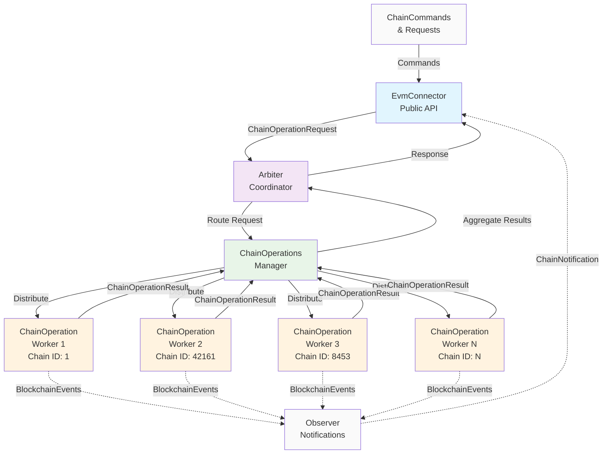
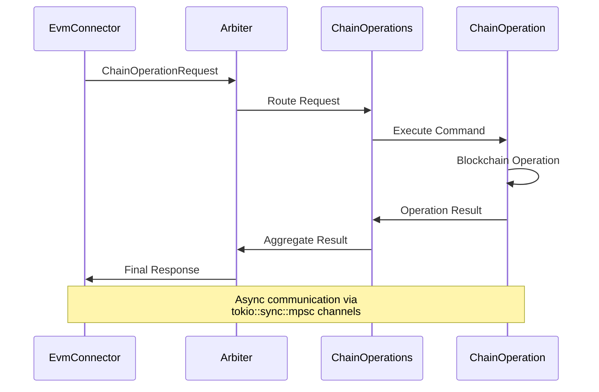

# Alloy-EVM-Connector Architecture

## Architecture Diagram

## Component Details

### Public API Layer
- **EvmConnector**: Main interface for blockchain operations
  - Connects to multiple chains
  - Manages chain lifecycle (connect/disconnect)
  - Implements ChainConnector trait
  - Publishes blockchain events via Observer pattern

### Coordination Layer
- **Arbiter**: Central async coordinator
  - Three core functions: `new()`, `start()`, `stop()`
  - Routes requests between API and workers
  - Manages resource lifecycle with AsyncLoop
  - Handles graceful shutdown

### Worker Management Layer
- **ChainOperations**: Worker pool manager
  - Manages multiple ChainOperation workers
  - Routes commands to appropriate chain workers
  - Aggregates results from workers
  - Handles worker lifecycle

### Worker Layer
- **ChainOperation**: Individual blockchain workers
  - One worker per blockchain (Ethereum, Arbitrum, Base, etc.)
  - Handles custody operations (custodyToConnector, callConnector)
  - Manages blockchain provider and wallet
  - Executes smart contract interactions

## Key Operations

### Custody Operations
- **CustodyToConnector**: Transfer funds from custody to connector
- **CallConnector**: Execute connector operations (e.g., Across deposits)
- **SetupCustody**: Initialize custody with tokens
- **ApproveToken**: Approve token spending

### Cross-Chain Operations
- **Across Protocol Integration**: Cross-chain bridge operations
- **Merkle Proof Generation**: CAHelper for secure custody operations
- **Multi-Chain Coordination**: Simultaneous operations across chains

## Data Flow

1. **Request Flow**: EvmConnector → Arbiter → ChainOperations → ChainOperation
2. **Response Flow**: ChainOperation → ChainOperations → Arbiter → EvmConnector
3. **Event Flow**: ChainOperation → Observer → EvmConnector → Main System

## Channel Communication

## Architecture Benefits

- **Scalability**: Easy to add new blockchain networks
- **Reliability**: Isolated workers prevent cross-chain failures
- **Maintainability**: Clear separation of concerns
- **Async Performance**: Non-blocking operations across all layers
- **Consistent Pattern**: Follows proven binance module architecture