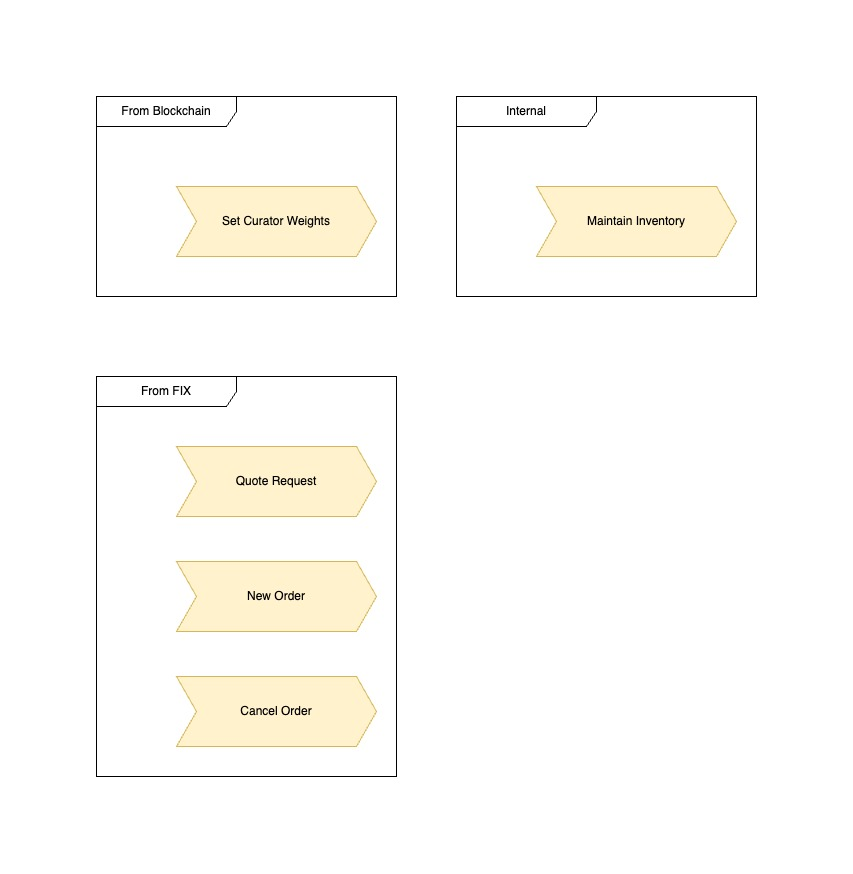
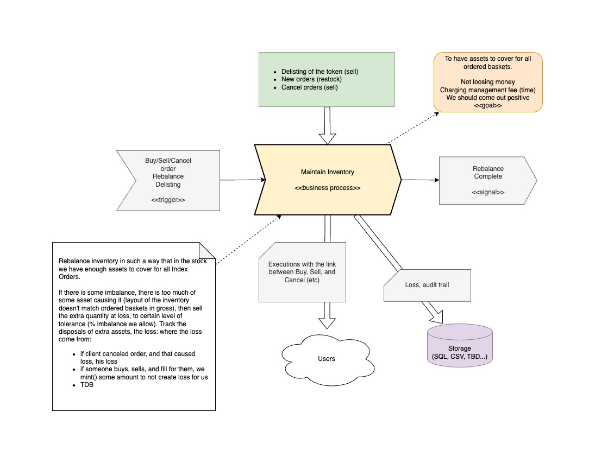
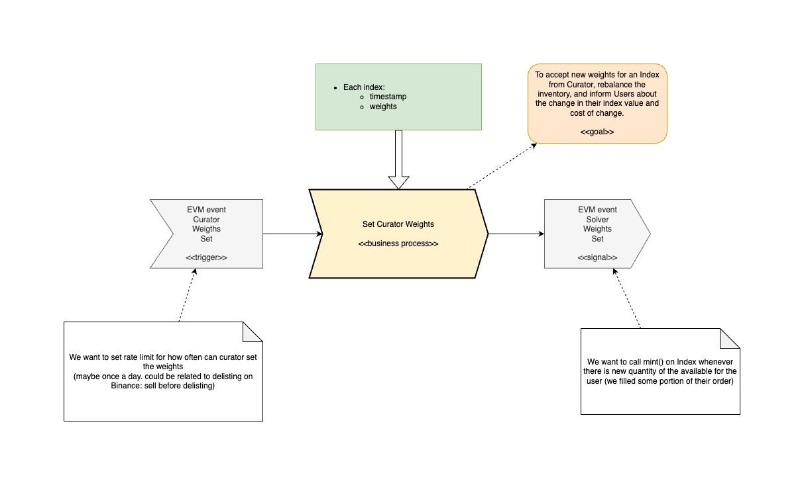
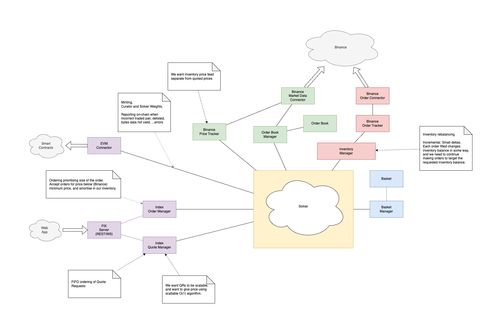
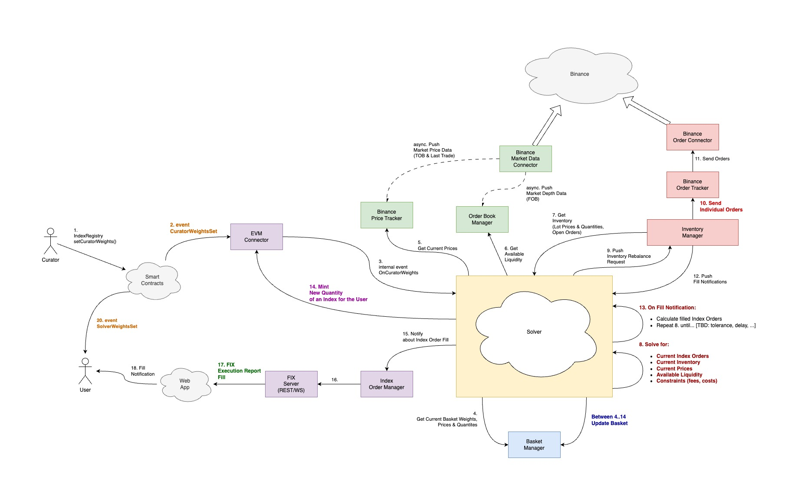
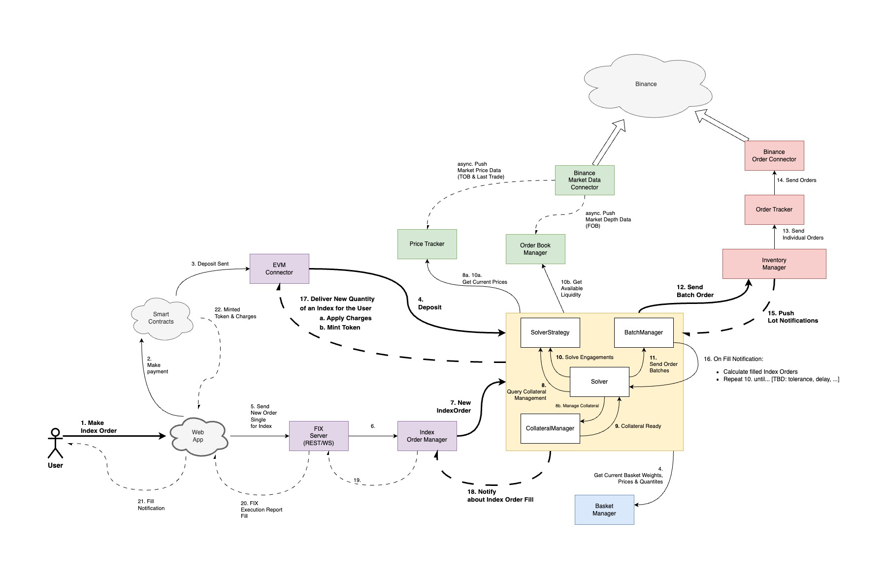

# Solver Design

## Business Analysis

### Processes

#### Maintain Inventory

#### Setting Weights

## Technical Design

### Components

### Collaboration

#### Seting Weights

#### Making Index Order
